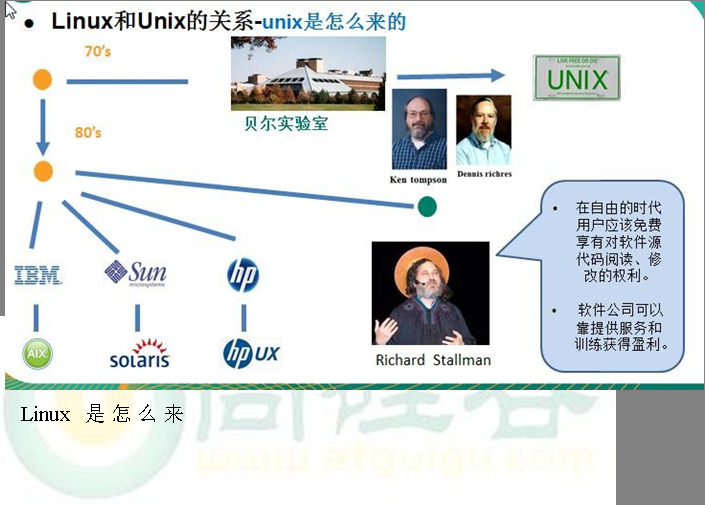
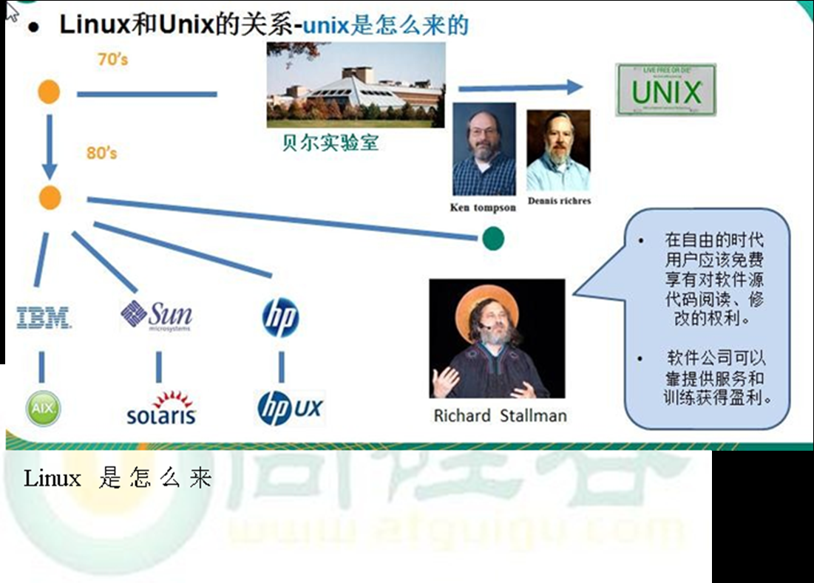
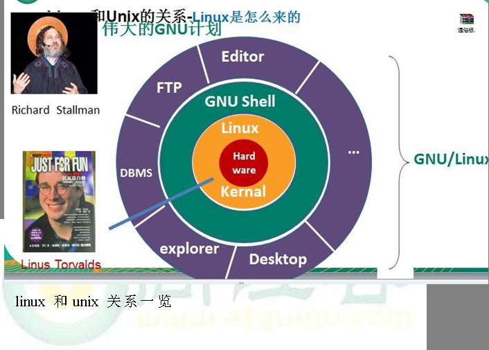
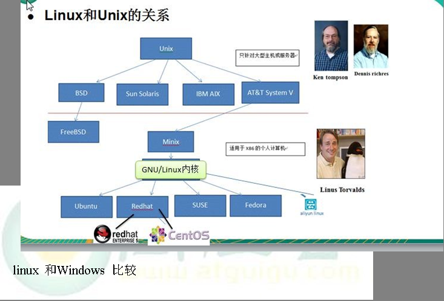
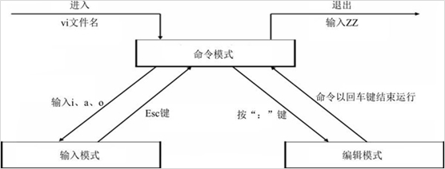

# 第一章 Linux基础篇 Linux入门

## Linux介绍

> Linux的读法 [李纽克斯 利尼克斯]
>
> Linux特点: 免费,开源,安全,高效稳定,处理高并发强悍
>
> 创始人: 林纳斯-托瓦斯
>
> 吉祥物:企鹅
>
> 主要的发行版: centos ubuntu  redhat 红旗 U麒麟 deepin
>
> 目前主要的操作系统有
>
> Windows Linux Mac 安卓 苹果 车载系统

## Unix的演化

> Unix产生在贝尔实验室 又凯-汤姆逊和詹姆斯-古道为玩游戏用B语言二次开发
>
> 后来又用C语言重新编译了系统.









## 虚拟机安装

百度

# 第二章 Linux目录介绍

```bash
[root@node01 ~]# cd /
[root@node01 /]# ll
total 24
# 是binary的缩写这个目录存放着最长使用的指令
lrwxrwxrwx.   1 root root    7 二月 26 18:56 bin -> usr/bin
# 存放Linux启动时使用的一些核心文件包括镜像
dr-xr-xr-x.   5 root root 4096 二月 26 19:04 boot
# 类似于Windows的设备管理器,把所有硬件以文件形式储存
drwxr-xr-x.  20 root root 3320 二月 26 19:07 dev
# 系统配置，启动程序
drwxr-xr-x. 132 root root 8192 二月 26 19:07 etc
# 普通用户的家，目录默认数据存放目录
drwxr-xr-x.   3 root root   16 二月 26 19:02 home
# 共享库文件和内核模块存放目录
lrwxrwxrwx.   1 root root    7 二月 26 18:56 lib -> usr/lib
lrwxrwxrwx.   1 root root    9 二月 26 18:56 lib64 -> usr/lib64
drwxr-xr-x.   2 root root    6 十一  5  2016 media
# 临时挂载储存设备的挂载点
drwxr-xr-x.   2 root root    6 十一  5  2016 mnt
# 额外的应用软件包
drwxr-xr-x.   3 root root   16 二月 26 19:00 opt
# 操作系统运行时，进程信息和内核信息存放在这里 
dr-xr-xr-x. 230 root root    0 二月 26 19:07 proc
# Linux超级权限用户root的家目录
dr-xr-x---.  14 root root 4096 二月 26 19:10 root
drwxr-xr-x.  39 root root 1220 二月 26 19:10 run
# 和管理系统相关的命令，【超级管理员用】
lrwxrwxrwx.   1 root root    8 二月 26 18:56 sbin -> usr/sbin
drwxr-xr-x.   2 root root    6 十一  5  2016 srv
dr-xr-xr-x.  13 root root    0 二月 26 19:07 sys
# 临时文件目录，这个目录被当作回收站使用
drwxrwxrwt.  18 root root 4096 二月 26 20:17 tmp
# 用户或系统软件应用程序目录
drwxr-xr-x.  13 root root  155 二月 26 18:56 usr
# 存放系统日志的目录
drwxr-xr-x.  20 root root  282 二月 26 19:04 var
```

## 4.1      Linux 目录总结一下

1)  linux 的目录中有且只要一个根目录 /

2)  linux 的各个目录存放的内容是规划好，不用乱放文件。

3)  linux 是以文件的形式管理我们的设备，因此 linux 系统，一切皆为文件。

4)  linux 的各个文件目录下存放什么内容，大家必须有一个认识。

5)  学习后，你脑海中应该有一颗 linux 目录树

## 4.2 学习Linux终端命令的原因

- Linux刚面世时并没有图形界面, 所有的操作全靠命令完成, 如 磁盘操作、文件存取、目录操作、进程管理、文件权限 设定等

- 在职场中，大量的服务器维护工作都是在远程通过SSH客户端 来完成的， 并没有图形界面， 所有的维护工作都需要通过命令来完成

# 第三章vi 和 vim 编辑器  

## 1. vi编辑器的三种模式



## 入门案例

```sh
## 在root用户的家目录查看当前目录下的文件和文件夹
[root@localhost ~]# ll
总用量 8
-rw-------. 1 root root 1326 2月  26 21:32 anaconda-ks.cfg
-rw-r--r--. 1 root root 1374 2月  26 21:37 initial-setup-ks.cfg
drwxr-xr-x. 2 root root    6 2月  26 21:37 公共
drwxr-xr-x. 2 root root    6 2月  26 21:37 模板
drwxr-xr-x. 2 root root    6 2月  26 21:37 视频
drwxr-xr-x. 2 root root    6 2月  26 21:37 图片
drwxr-xr-x. 2 root root    6 2月  26 21:37 文档
drwxr-xr-x. 2 root root    6 2月  26 21:37 下载
drwxr-xr-x. 2 root root    6 2月  26 21:37 音乐
drwxr-xr-x. 2 root root    6 2月  26 21:37 桌面
# 进入桌面这个文件夹下
[root@localhost ~]# cd 桌面
# 使用vim编辑器编辑一个叫HelloWorld.java
[root@localhost 桌面]# vim HelloWorld.java

#输入i进入编辑模式
public class HelloWorld{
        public void main(String[],args){
                Systom.out.println("Hello World");
        }
}
~                                                                               
~                                                                               
~                                                                                       # 输入Esc退出编辑模式
进入:模式保存并退出
:wq 
```

## vim复制黏贴

```sh
#yy复制当前行
public class HelloWorld{
#p粘贴当前行
#5yy复制光标及以下5行
public class HelloWorld{
        public void main(String[],args){
                Systom.out.println("Hello World");
        }
}
#黏贴
public class HelloWorld{
        public void main(String[],args){
                Systom.out.println("Hello World");
        }
}
```

| **命令** | **功能**                    |
| -------- | --------------------------- |
| o        | 在当前行后面插入一空行      |
| O        | 在当前行前面插入一空行      |
| dd       | 删除光标所在行              |
| ndd      | 从光标位置向下连续删除 n 行 |
| yy       | 复制光标所在行              |
| nyy      | 从光标位置向下连续复制n行   |
| p        | 粘贴                        |
| u        | 撤销上一次命令              |
| gg       | 回到文件顶部                |
| G        | 回到文件末尾                |
| /str     | 查找str                     |


## vim删除

```sh
public class HelloWorld{
public class HelloWorld{
        public void main(String[],args){
                Systom.out.println("Hello World");
        }
#dd删除当前行
public class HelloWorld{
        public void main(String[],args){
                #x删除当前字母
                ystom.out.println("Hello World");
 #2dd 删除下面两行
 
```

## vim插入

~~~sh
o	在当前行后面插入一空行
O	在当前行前面插入一空行
i   在当前行插入
~~~

| **命令**            | **功能**                      |
| ------------------- | :---------------------------- |
| :w 文件             | 另存为                        |
| :w                  | 保存(ctrl + s)                |
| :q                  | 退出, 如果没有保存,不允许退出 |
| :q!                 | 强行退出, 不保存退出          |
| :wq                 | 保存并退出                    |
| :x                  | 保存并退出                    |
| :set nu             | 设置行号                      |
| :%s/旧文本/新文本/g | 文本替换                      |

# 关机重启

```sh
shutdown
shutdown -h now : 表示立即关机shutdown -h 1 : 表示 1 分钟后关机shutdown -r now:  立即重启
halt
就是直接使用，效果等价于关机
reboot
就是重启系统。
syn  ：	把内存的数据同步到磁盘

```

